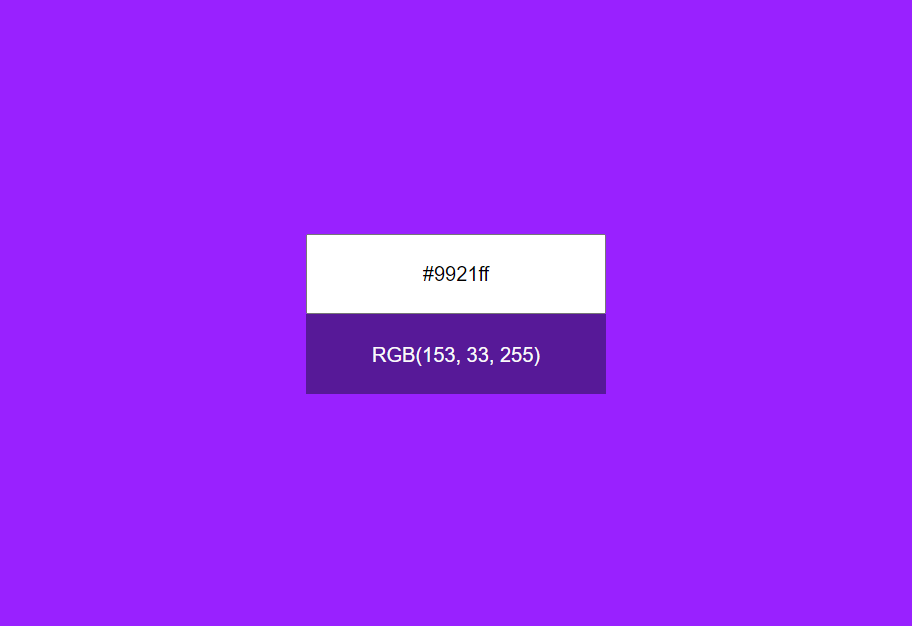
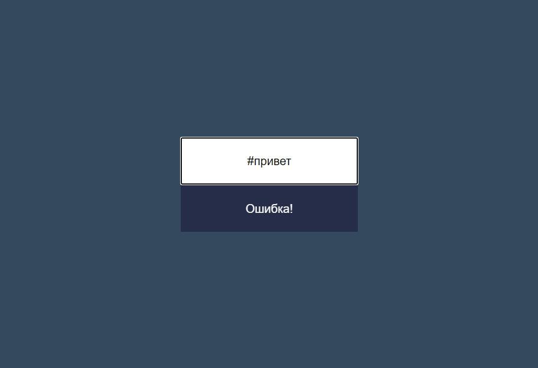
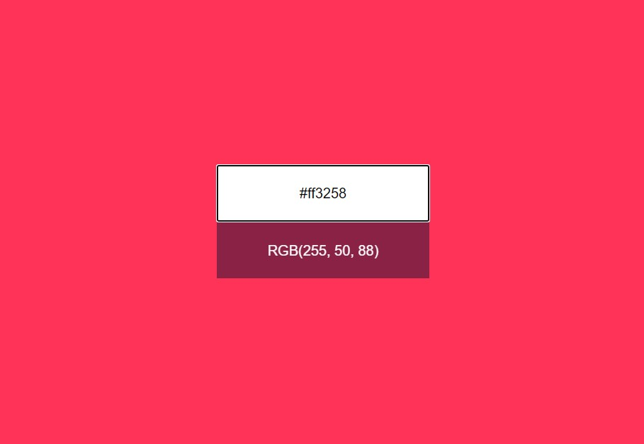

# Конвертер цветов из HEX в RGB

Учебный проект курса [React для JS-разработчиков](https://netology.ru/programs/react)

## **Задача**

Создание конвертера цветов из HEX в RGB.

## **Интерфейс конвертера**

При правильном вводе цвета он показывает его представление в формате RGB и меняет цвет фона на заданный:

Конвертер при вводе неправильного цвета в формате HEX сообщает об ошибке:

Необходимо дожидаться ввода всех семи символов, включая решётку, прежде чем приложение принимает решение о том, показывать ошибку или менять цвет фона.
## **Стек технологий**

## [**Демо**](https://hex2rgb.vercel.app/)

